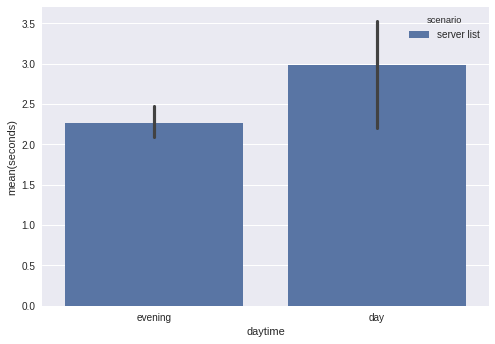
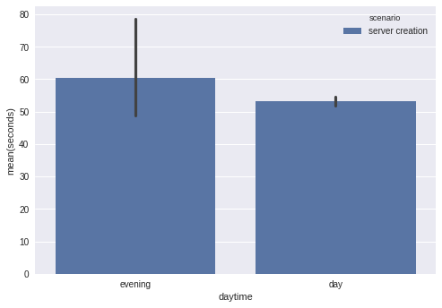

Cloud Computing
================
Summer Term 2017
----------------
#### Assignment 2 - Cloud Benchmarking and Orchestration

### Student Group
  **Name:** CC_GROUP_16

  **Members:**
  1. Peter Schuellermann |   *380490*
  2. Sebastian Schasse   |   *318569*
  3. Felix Kybranz       |   *380341*
  4. Hafiz Umar Nawaz    |   *389922*

* * *

### 1. Cloud Benchmark

We're using a self-written script, to benchmark the api with the two
given scenarios.

Before we can use the script, we firstly need to prepare the
environment. We need to create and upload a ssh key. We need a
security group with icmp ingress as well as port 22 ingress for
ssh. Lastly a floating ip is necessary.

``` shell
# create ssh key and upload to openstack
ssh-keygen -t rsa -b 4096 -C $USER
openstack keypair create $USER --public-key ~/.ssh/id_rsa.pub

# create security group with icmp and ssh ingress
openstack security group create grp16_security_group
openstack security group rule create grp16_security_group \
  --description icmp-ingress --ingress --protocol icmp
openstack security group rule create grp16_security_group \
  --description ssh-ingress --ingress --protocol tcp --dst-port 22:22

# create floating ip
openstack floating ip create tu-internal
```

The actual benchmarking script is written in ruby and will append the
results to a csv file. Each line consists of the time, the benchmark
is performed and the benchmark time either for scenario one or
two. For each execution of the benchmark, we execute scenario one and
two three times in a row. The reason is to not have falsy spikes of
single measurements.

In the first scenario, we measure the time of how long it takes to
execute the command `openstack server list`. Because, we didn't
prepare any instances, the list of servers will be empty. We're just
interested in the time of the command.

In the second scenario, there must be the preparation done as
described above. Here we're measuring the time of executing the steps
to create a server, connecting a floating ip to it and waiting until
port 22 is opened. When port 22 is opened, the server is booted, ssh
is started and you could start to use it.

Hint: For a better understanding read from bottom to top.

``` ruby
#!/usr/bin/env ruby

def floating_ip
  @floating_ip ||=
    `openstack floating ip list -c 'Floating IP Address' -f value`.strip
end

def destroy_server
  puts 'destroying server'
  `openstack server delete grp16_instance`
  while `openstack server list`.include?('grp16_instance')
    sleep 0.5
  end
end

def wait_for_server
  print 'waiting for server '
  loop do
    error = `bash -c '(echo > /dev/tcp/#{floating_ip}/22) 2>&1'`
    break if error.empty?
    print '.'
    sleep 0.25
  end
  print "\n"
end

def create_server
  puts 'creating server'
  cmd =
    'openstack server create grp16_instance'\
    ' --image ubuntu-16.04'\
    " --flavor 'Cloud Computing'"\
    " --availability-zone 'Cloud Computing 2017'"\
    ' --network cc17-net'\
    ' --security-group grp16_security_group'\
    " --key-name #{ENV['USER']}"
  `#{cmd}`
  sleep 1 # api sometimes too slow...
  puts 'connecting floating ip to server'
  `openstack server add floating ip grp16_instance #{floating_ip}`
end

def server_creation_duration
  puts 'start measuring server creation'
  start = Time.now
  create_server
  wait_for_server
  duration = Time.now - start
  destroy_server
  puts 'end measuring server creation'
  duration
end

def server_list_duration
  puts 'start measuring server list'
  start = Time.now
  `openstack server list`
  duration = Time.now - start
  puts 'end measuring server list'
  duration
end

def daytime(time)
  if 7 <= time.hour && time.hour <= 15
    'day'
  elsif 16 <= time.hour && time.hour <= 23
    'evening'
  else
    'night'
  end
end

def append_result
  sc_one_time = Time.now
  sc_one_daytime = daytime sc_one_time
  scenario_one = server_list_duration
  sc_two_time = Time.now
  sc_two_daytime = daytime sc_two_time
  scenario_two = server_creation_duration
  File.open('results.csv', 'a') do |f|
    f << "#{sc_one_time};#{sc_one_daytime};server list;#{scenario_one}\n"
    f << "#{sc_two_time};#{sc_two_daytime};server creation;#{scenario_two}\n"
  end
end

3.times { append_result }
```

Our results for the measurements are the following:

``` text
2017-06-26 10:17:16 +0200;day;server list;1.898167474
2017-06-26 10:17:18 +0200;day;server creation;44.236652119
2017-06-26 10:18:10 +0200;day;server list;1.909897429
2017-06-26 10:18:12 +0200;day;server creation;52.718781472
2017-06-26 10:19:12 +0200;day;server list;1.921518069
2017-06-26 10:19:14 +0200;day;server creation;43.841367673
2017-06-26 17:35:17 +0200;evening;server list;2.404962081
2017-06-26 17:35:21 +0200;evening;server creation;54.91377217
2017-06-26 17:36:22 +0200;evening;server list;2.959915032
2017-06-26 17:36:26 +0200;evening;server creation;127.804455102
2017-06-26 17:38:41 +0200;evening;server list;2.101337913
2017-06-26 17:38:44 +0200;evening;server creation;80.621974535
2017-07-02 00:00:23 +0200;night;server list;3.16800319
2017-07-02 00:00:26 +0200;night;server creation;53.355386207
2017-07-02 00:01:30 +0200;night;server list;3.27768787
2017-07-02 00:01:33 +0200;night;server creation;50.141687503
2017-07-02 00:02:35 +0200;night;server list;2.844035127
2017-07-02 00:02:38 +0200;night;server creation;46.623196888
```

Scenario one (server list).



Scenario two (server creation).



In the results we can see, that server list api requests take between
1.9 and 3.3 seconds. At ~10 a.m. the requests were the fastest and had
the fewest deviation. Probably not many people are using the api at
that time. This correlates to the server creation at that
time. Evening times seem much busier.

Server cration takes between 44 and 128 seconds. We expected a
correlation between server list and server creation at any daytime,
but in the night server creation was almost as fast as during 10
a.m.. This may also be just a network latency problem, though.

The busiest time is in the evening. One server creation process took
over 2 minutes, which is quite long.

### 2. Introducing Heat

Firstly we need to prepare the environment the same way as described
in excercise 1.

Then we can actually create the stack with the correct parameters.

``` shell
openstack stack create \
  --parameter name=grp16_instance \
  --parameter key_pair=$USER \
  --parameter 'flavor=Cloud Computing' \
  --parameter image=ubuntu-16.04 \
  --parameter 'zone=Cloud Computing 2017' \
  --parameter network=cc17-net \
  --parameter security_groups=grp16_security_group \
  -t server.yaml grp16_stack
```

To have the server reachable, we need to connect it to the floating ip.

``` shell
grp16_ip=$(openstack floating ip list -c 'Floating IP Address' -f value)
openstack server add floating ip grp16_instance $grp16_ip
```

Then we can connect to the server via ssh.

``` shell
ssh ubuntu@$grp16_ip
```

To cleanup, we delete the stack and check the server is gone.

``` shell
openstack stack delete -y grp16_stack
openstack server list
```

### 3. Advanced Heat Templates

``` yaml
heat_template_version: 2015-10-15

description: HOT template for two interconnected VMs with floating ips.

parameters:
  key_pair:
    type: string
    label: Key Pair
    constraints:
      - custom_constraint: nova.keypair

resources:
  private_net:
    type: OS::Neutron::Net
    properties:
      name: private_net

  private_subnet:
    type: OS::Neutron::Subnet
    depends_on: private_net
    properties:
      network_id: { get_resource: private_net }
      cidr: 172.16.2.0/24
      gateway_ip: 172.16.2.1

  router:
    type: OS::Neutron::Router
    properties:
      external_gateway_info:
        network: tu-internal

  router_interface:
    type: OS::Neutron::RouterInterface
    depends_on:
      - router
      - private_subnet
    properties:
      router_id: { get_resource: router }
      subnet_id: { get_resource: private_subnet }

  http_ssh_security_group:
    type: OS::Neutron::SecurityGroup
    properties:
      name: http_ssh_security_group
      rules:
        - direction: ingress
          protocol: icmp
        - direction: ingress
          port_range_max: 22
          port_range_min: 22
          protocol: tcp
        - direction: ingress
          port_range_max: 80
          port_range_min: 80
          protocol: tcp

  frontend:
    type: server.yaml
    depends_on:
      - http_ssh_security_group
      - private_net
    properties:
      name: frontend
      flavor: Cloud Computing
      zone: Cloud Computing 2017
      image: ubuntu-16.04
      security_groups:
        - http_ssh_security_group
      key_pair: { get_param: key_pair }
      network: { get_resource: private_net }

  frontend_ip:
    type: OS::Neutron::FloatingIP
    properties:
      floating_network_id: tu-internal

  frontend_ip_assoc:
    type: OS::Neutron::FloatingIPAssociation
    depends_on:
      - frontend
      - frontend_ip
    properties:
      floatingip_id: { get_resource: frontend_ip }
      port_id: { get_attr: [frontend, port] }

  backend_group:
    type: OS::Heat::ResourceGroup
    depends_on:
      - http_ssh_security_group
      - private_net
    properties:
      count: 2
      resource_def:
        type: server.yaml
        properties:
          name: backend-%index%
          key_pair: { get_param: key_pair }
          flavor: Cloud Computing
          image: ubuntu-16.04
          security_groups:
            - http_ssh_security_group
          zone: Cloud Computing 2017
          network: { get_resource: private_net }

outputs:
  frontend_public_ip:
    description: Private IP address of frontend.
    value: { get_attr: [ frontend_ip ] }
```

Instantiating the `server-landscape.yaml` template:

``` shell
openstack stack create \
  --parameter key_pair=schasse \
  -t server-landscape.yaml \
  grp16_server_landscape
```

Extracting `floating_ip` and private ips:

``` shell
openstack stack show grp16_server_landscape
openstack server list
```
Testing internet connectivity:

``` shell
local $ ssh -A ubuntu@10.200.2.176
frontend $ curl whatthecommit.com/index.txt
We'll figure it out on Monday
frontend $ ssh ubuntu@172.16.2.4
backend-0 $ curl whatthecommit.com/index.txt
I expected something different.
backend-0 $ exit
frontend $ ssh ubuntu@172.16.2.5
backend-1 $ curl whatthecommit.com/index.txt
arrrggghhhhh fixed!
backend-0 $ exit
fronted $ exit
```
Delete stack:

``` shell
for i in 1 2 3 4 5; do openstack delete -y --wait grp16_server_landscape; done
```
