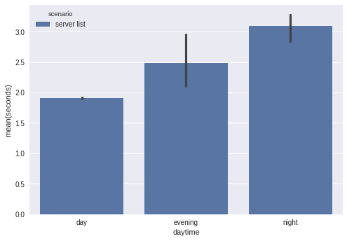
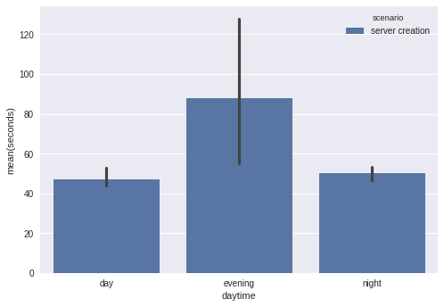

Cloud Computing
================
Summer Term 2017
----------------
#### Assignment 2 - Cloud Benchmarking and Orchestration

### Student Group
  **Name:** CC_GROUP_16

  **Members:**
  1. Peter Schuellermann |   *380490*
  2. Sebastian Schasse   |   *318569*
  3. Felix Kybranz       |   *380341*
  4. Hafiz Umar Nawaz    |   *389922*

* * *

### 1. Cloud Benchmark

We're using a self-written script, to benchmark the api with the two
given scenarios.

Before we can use the script, we firstly need to prepare the
environment. We need to create and upload a ssh key. We need a
security group with icmp ingress as well as port 22 ingress for
ssh. Lastly a floating ip is necessary.

``` shell
# create ssh key and upload to openstack
ssh-keygen -t rsa -b 4096 -C $USER
openstack keypair create $USER --public-key ~/.ssh/id_rsa.pub

# create security group with icmp and ssh ingress
openstack security group create grp17_security_group
openstack security group rule create grp17_security_group \
  --description icmp-ingress --ingress --protocol icmp
openstack security group rule create grp17_security_group \
  --description ssh-ingress --ingress --protocol tcp --dst-port 22:22

# create floating ip
cc-openstack floating ip create tu-internal
```

The actual benchmarking script is written in ruby and will append the
results to a csv file. Each line consists of the time, the benchmark
is performed and the benchmark time either for scenario one or
two. For each execution of the benchmark, we execute scenario one and
two three times in a row. The reason is to not have falsy spikes of
single measurements.

In the first scenario, we measure the time of how long it takes to
execute the command `openstack server list`. Because, we didn't
prepare any instances, the list of servers will be empty. We're just
interested in the time of the command.

In the second scenario, there must be the preparation done as
described above. Here we're measuring the time of executing the steps
to create a server, connecting a floating ip to it and waiting until
port 22 is opened. When port 22 is opened, the server is booted, ssh
is started and you could start to use it.

Hint: For a better understanding read from bottom to top.

``` ruby
#!/usr/bin/env ruby

def floating_ip
  @floating_ip ||=
    `openstack floating ip list -c 'Floating IP Address' -f value`.strip
end

def destroy_server
  puts 'destroying server'
  `openstack server delete grp17_instance`
  while `openstack server list`.include?('grp17_instance')
    sleep 0.5
  end
end

def wait_for_server
  print 'waiting for server '
  loop do
    error = `bash -c '(echo > /dev/tcp/#{floating_ip}/22) 2>&1'`
    break if error.empty?
    print '.'
    sleep 0.25
  end
  print "\n"
end

def create_server
  puts 'creating server'
  cmd =
    'openstack server create grp17_instance'\
    ' --image ubuntu-16.04'\
    " --flavor 'Cloud Computing'"\
    " --availability-zone 'Cloud Computing 2017'"\
    ' --network cc17-net'\
    ' --security-group grp17_security_group'\
    " --key-name #{ENV['USER']}"
  `#{cmd}`
  puts 'connecting floating ip to server'
  `openstack server add floating ip grp17_instance #{floating_ip}`
end

def server_creation_duration
  puts 'start measuring server creation'
  start = Time.now
  create_server
  wait_for_server
  duration = Time.now - start
  destroy_server
  puts 'end measuring server creation'
  duration
end

def server_list_duration
  puts 'start measuring server list'
  start = Time.now
  `openstack server list`
  duration = Time.now - start
  puts 'end measuring server list'
  duration
end

def daytime(time)
  if 7 <= time.hour && time.hour <= 15
    'day'
  elsif 16 <= time.hour && time.hour <= 23
    'evening'
  else
    'night'
  end
end

def append_result
  sc_one_time = Time.now
  sc_one_daytime = daytime sc_one_time
  scenario_one = server_list_duration
  sc_two_time = Time.now
  sc_two_daytime = daytime sc_two_time
  scenario_two = server_creation_duration
  File.open('results.csv', 'a') do |f|
    f << "#{sc_one_time};#{sc_one_daytime};server list;#{scenario_one}\n"
    f << "#{sc_two_time};#{sc_two_daytime};server creation;#{scenario_two}\n"
  end
end

3.times { append_result }
```

Our results for the measurements are the following:

``` text
2017-06-21 18:35:32 +0200;evening;server list;1.899074509
2017-06-21 18:35:35 +0200;evening;server creation;50.507970476
2017-06-21 18:46:26 +0200;evening;server list;2.64838352
2017-06-21 18:46:30 +0200;evening;server creation;46.549212898
2017-06-21 18:47:22 +0200;evening;server list;2.051581212
2017-06-21 18:47:25 +0200;evening;server creation;46.005325541
2017-06-21 18:48:20 +0200;evening;server list;2.060552441
2017-06-21 18:48:23 +0200;evening;server creation;47.217909656
2017-06-22 13:24:04 +0200;day;server list;3.527799193
2017-06-22 13:24:08 +0200;day;server creation;53.149687065
2017-06-22 13:25:07 +0200;day;server list;3.204144725
2017-06-22 13:25:11 +0200;day;server creation;54.532848295
2017-06-22 13:26:14 +0200;day;server list;2.200417879
2017-06-22 13:26:18 +0200;day;server creation;51.837295877
2017-06-22 17:35:17 +0200;evening;server list;2.404962081
2017-06-22 17:35:21 +0200;evening;server creation;54.91377217
2017-06-22 17:36:22 +0200;evening;server list;2.959915032
2017-06-22 17:36:26 +0200;evening;server creation;127.804455102
2017-06-22 17:38:41 +0200;evening;server list;2.101337913
2017-06-22 17:38:44 +0200;evening;server creation;80.621974535
2017-06-22 17:55:02 +0200;evening;server list;2.066445354
2017-06-22 17:55:05 +0200;evening;server creation;49.318446759
2017-06-22 17:56:01 +0200;evening;server list;2.328977439
2017-06-22 17:56:05 +0200;evening;server creation;49.767466696
2017-06-22 17:57:03 +0200;evening;server list;2.125526848
2017-06-22 17:57:06 +0200;evening;server creation;51.454686795
```

Scenario one (server list).



Scenario two (server creation).



### 2. Introducing Heat

Firstly we need to prepare the environment the same way as described
in excercise 1.

Then we can actually create the stack with the correct parameters.

``` shell
openstack stack create \
  --parameter name=grp17_instance \
  --parameter key_pair=$USER \
  --parameter 'flavor=Cloud Computing' \
  --parameter image=ubuntu-16.04 \
  --parameter 'zone=Cloud Computing 2017' \
  --parameter network=cc17-net \
  -t server.yml grp17_stack
```

To have the server reachable, we need to connect it to the floating ip.

``` shell
grp17_ip=$(openstack floating ip list -c 'Floating IP Address' -f value)
openstack server add floating ip grp17_instance $grp17_ip
```

Then we can connect to the server via ssh.

``` shell
ssh ubuntu@$grp17_ip
```

To cleanup, we delete the stack and check the server is gone.

``` shell
openstack stack delete -y grp17_stack
openstack server list
```

### 3. Advanced Heat Templates

### Submission Deliverable

1. Detailed description of your cloud benchmarking methodology, including any scripts or other code
2. Benchmarking results of the six different combinations of scenarios and time slots, including plots and interpretation of the results
3. Commented listing of commands you executed for Task 2
4. The contents of your server-landscape.yml​ file
5. Commented listing of commands you executed to test your advanced Heat template
